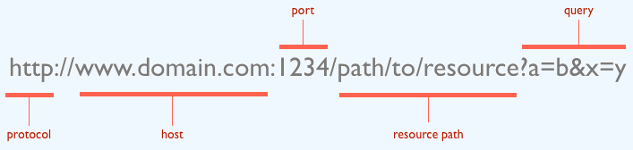

# Protocolo HTTP

| Cliente | Servidor |
| -- | -- |
| - Proactivo, inicia comunicación| - reactivo, espera requerimientos |
| - Hace requerimientos(peticiones a un servidor)| - Responde a varios clientes|

## Hiper-Text Transfer Protocol HTTP

Protocolo -> cliente-servidor.

Para comunicar aplicaciones.


## Peticiones o Request


### Metadatos

- **GET**: Solicita un recurso. Solo deben recuperar datos.
- **POST**: Envía un recurso a una entidad, causando a menudo un cambio de estado o efecto servidor.
- **HEAD**: Pide una respuesta idéntica a `GET` pero sin cuerpo.
- **PUT**: Reemplaza todos las representaciones actuales del recurso de destino con la carga util de la petición.
- **DELETE**: Borra un recurso especifico.
- **CONNECT**: Establece un túnel hacia el servidor identificado por el recurso.
- **OPTIONS**: Describe opciones de comunicación para el recurso.
- **TRACE**: PHARCH.

### Request Headers

- **Host**: Dominio requerido.
- **User-Agent**: Nombre del buscador/OS.
- **Referer**
- **Authorization**: Una password o alguna cosa.
- **Cookie**: Enviar cookie que el servidor envió antes. Control de sesiones.
- **Range**: te permite continuar con las descargas ("get bytes 1000-2997").
- **Cache-control**:
- **If-Modified-Since**
- **If-None-March**
- **Accept**
- **Accept-Encoding**
- **Accept-Language**: Tipo de lenguaje.
- **Content-Type**: Tipo de contenido del cuerpo.
- **Content-Encoding**
- **Connection**

----

Con `GET` los parámetros de consulta van en URL.



Cuando no es GET, los parámetros van detrás de las cabeceras

```HTTP
POST /recepcion_formulario  HTTP/1.1
Host: ...
...
variable_1 = valor_variable_1
variable_2 = valor_variable_2
```

que corresponde con:

```HTML
<form action="recepcion_formulario" method="post">
<input name="variable_1">
<input name="variable_2">
</form>
```